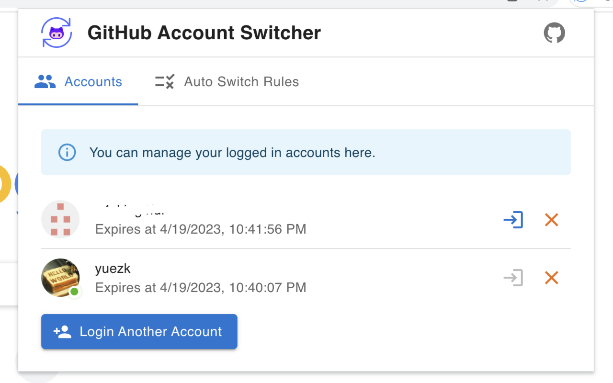
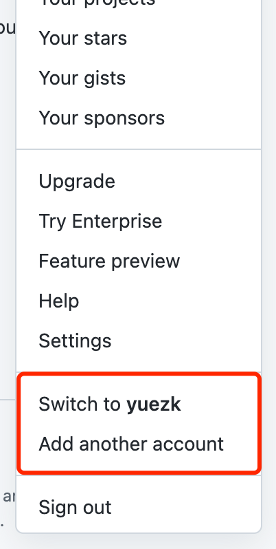

# GitHub Account Switcher Browser Extension

The GitHub Account Switcher is a user-friendly browser extension for Chrome, Edge, and Firefox designed to help developers effortlessly switch between multiple GitHub accounts without the need to log in and out constantly. It's perfect for developers who manage personal, work, or enterprise accounts, as this extension streamlines your workflow and lets you concentrate on your projects.

<table>
<tr>
  <td></td>
  <td></td>
</tr>
</table>


## Features

- Effortless account switching: Instantly switch between multiple GitHub accounts with a single click.
- Automatic account switching: Automatically switch to the relevant account when you visit a specific GitHub URL.
- Time-saving: Eliminates the need to manually log in and out of different accounts.

## Installation

<a href="https://chrome.google.com/webstore/detail/glnlddiaebecckddpfcangohjebhhoea"></a>
<a href="https://addons.mozilla.org/en-US/firefox/addon/github-account-switcher/"></a>
<a href="https://microsoftedge.microsoft.com/addons/detail/mibpjgghmehliaphcpjjhhfcopeodene"></a>
<a href="https://chrome.google.com/webstore/detail/glnlddiaebecckddpfcangohjebhhoea"></a>

## Usage

The extension automatically detects your GitHub accounts and lists them in the extension popup. To switch between accounts, just click on the account you want to use.

Alternatively, you can switch to a specific account by clicking the avatar icon in the top right corner of the GitHub page and selecting the desired account.

## Auto Switching

The extension can automatically switch to the appropriate account when you visit a specific GitHub URL. To enable this feature, you need to add Auto Switching Rules in the extension options.

Click the extension icon and select the Auto Switch Rules tab. Then click the `Add a Rule` button to add a new rule.

The rule consists of two parts: the URL matching pattern and the account. When you visit a GitHub URL that matches the pattern, the extension will automatically switch to the specified account. Here's an example:

Suppose you have two GitHub accounts: your personal account and your work account. Usually, GitHub assigns a unique prefix to your enterprise organization, such as `https://github.com/corp_prefix-xxx`. Your work account is typically associated with a distinct prefix or suffix, such as `<corp_prefix>_xxx` or `xxx_<corp_suffix>`.

When you visit your enterprise GitHub URL, you want to automatically switch to your work account. You can add a rule with the following settings:

- URL matching pattern: `/corp_prefix-.+?`, which matches all URLs containing the prefix of your enterprise organization.
- URL matching pattern: `/corp_prefix_.+?` or `/.+?_corp_suffix`, which matches all work account URLs of your enterprise organization.

> Of cause, feel free to combine the two rules into one, e.g., `/corp_prefix-.+?|/corp_prefix_.+?` or `/corp_prefix-.+?|/.+?_corp_suffix`.

## How It Works

This extension will save the cookies of your GitHub accounts in the extension's local storage. When you switch to an account, the extension will load the cookies from the local storage and restore them in the browser. When you visit a GitHub URL, the extension will check if the URL matches any Auto Switching Rules. If so, the extension will automatically switch to the specified account.

## Privacy

This extension does not collect any personal information. All data is stored locally in the extension's local storage.

## Development

### Prerequisites

Node 16.15.0 or later is required.

```bash
pnpm install
```

### Debug in Chrome

```bash
pnpm dev
```

The build output is in the `dist` folder.

Then load the extension in your browser, see [load unpacked in Chrome](https://developer.chrome.com/docs/extensions/mv3/getstarted/development-basics/#load-unpacked)

### Debug in Firefox

This extension doesn't support live reload in Firefox. You need to manually run `pnpm build` and reload the extension after each change.

```bash
pnpm build
```

The build output is in the `dist_firefox` folder.

Then load the extension in your browser, see [load temporary add-on in Firefox](https://extensionworkshop.com/documentation/develop/temporary-installation-in-firefox/)

## License

This project is licensed under the MIT License. See the [LICENSE](./LICENSE) file for more details.
